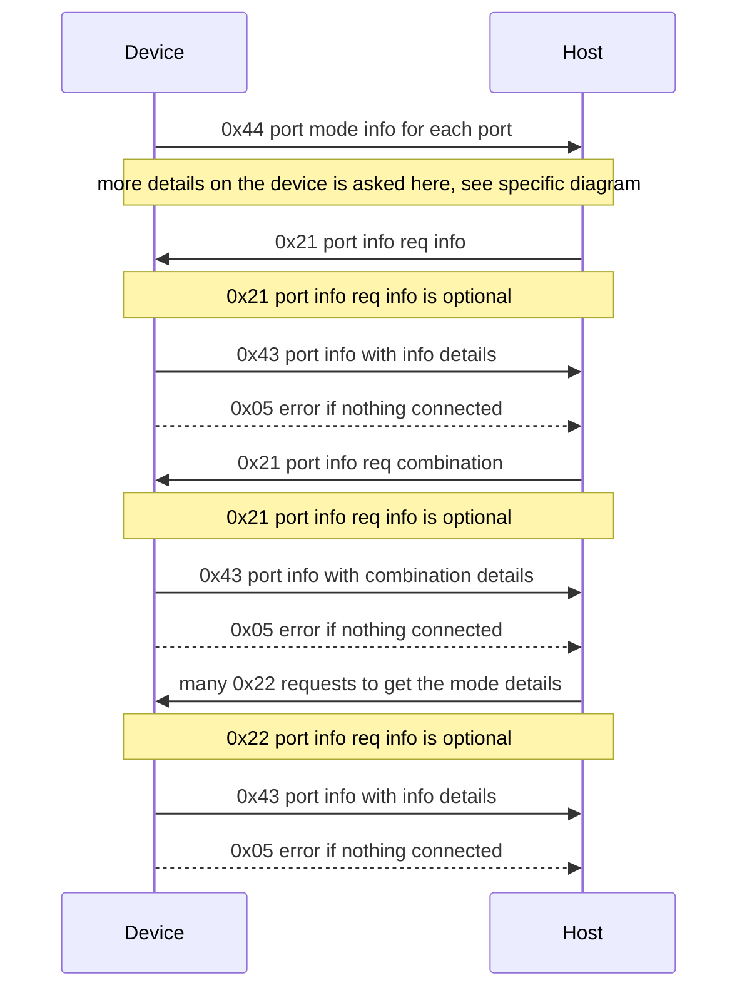

# LEGO Wirelesss Bluetooth Protocol 3.0.00 documentation

The main official documentation can be [found here on the official LEGO github](https://lego.github.io/lego-ble-wireless-protocol-docs/index.html). This documentation is an unofficial one containing missing elements and examples that helped creating the full project. It is also based on the [amazing work from sharpbrick](https://github.com/sharpbrick/docs).

This document mainly focusses on the communication flow.

In this document, we will use `->` for the communication comming from the the hub/device and `<-` from the host. So depending if you are a host or a device, you will have to react in a different way.

## Port flow

Here is the current flow and explaination following:



### Advertisement of connected elements

Once connected to the device, without sending any message, the device sends the sepcification of what is connected to it with a [Hub Attached I/O message (0x04)](https://lego.github.io/lego-ble-wireless-protocol-docs/index.html#hub-attached-i-o). As an example for a MoveHub with an additional RGB sensor connected and and additional motor:

```text
-> 0F-00-04-00-01-27-00-00-00-00-10-00-00-00-10
-> 0F-00-04-01-01-27-00-00-00-00-10-00-00-00-10
-> 0F-00-04-02-01-25-00-00-00-00-10-00-00-00-10
-> 0F-00-04-03-01-26-00-00-00-00-10-00-00-00-10
-> 09-00-04-10-02-27-00-00-01
-> 0F-00-04-32-01-17-00-00-00-00-01-06-00-00-20
-> 0F-00-04-3A-01-28-00-00-00-00-10-00-00-01-02
-> 0F-00-04-3B-01-15-00-02-00-00-00-00-00-01-00
-> 0F-00-04-3C-01-14-00-02-00-00-00-00-00-01-00
-> 0F-00-04-46-01-42-00-01-00-00-00-00-00-00-10
```

By default, when nothing is connected, there are still sensors like voltage, internal motors, etc. The default list for each known hub can be found on the [sharpbrick documentation](https://github.com/sharpbrick/docs/tree/master/hubs). 

This will translate into the following:

```text
Port 0 (A) an internal Motor with tacho
Port 1 (B) an internal Motor with tacho
Port 2 (C) a vision sensor connected
Port 3 (D) an external motor with tacho
Port 16 a virtual internal motor with tacho
Port 50 a RGB light
Port 58 an internal tilt sensor
Port 59 a current sensor
Port 60 a voltage sensor
Port 70 is unkown
```

The only difference with the default version is that there is on this version a vision sensor and an external motor connected. For the rest, this will always be advertised with the adjusted parameters.

This message is only coming from the device and never advertised otherwise.

### Advertiement for disconnection of element

Once an element is disconnected, a message is sent from the device with a [Hub Attached I/O message (0x04)](https://lego.github.io/lego-ble-wireless-protocol-docs/index.html#hub-attached-i-o). As an example:

```text
05-00-04-03-00
```

Those notifications are sent right away.

### Port information request and answer

For each of the previously annouced ports, you get more details informations by sending a [Port Information Request (0x21)](https://lego.github.io/lego-ble-wireless-protocol-docs/index.html#port-information-request) by specifying the port ID and the flag asking for the port information (0x01)

```text
<- 05-00-21-00-01
-> 0B-00-43-00-01-0F-03-06-00-07-00
```

The device will answer with a [0x43 message Port Information](https://lego.github.io/lego-ble-wireless-protocol-docs/index.html#port-information). There are 2 modes, one for the mode information and the other one for the possible mode combinations.

In the previous example, for the internal motor on port 0:

```
PortID: 0, InformationType: ModeInfo, Capabilities: Output, Input, LogicalCombinable, LogicalSynchronizable, TotalModeCount: 3, InputModes: 6, OutputModes: 7
```

The input and output modes represent which modes are input/outputs. So 0b0110 for input and 0b0111 and for output says that the mode 0 is only output, the mode 1 and mode 2 are both input and output.

In order to pupulate properly from scratch all the elements, you'll have to ask for each of the advertised ports those elements. In our case:

```text
<- 05-00-21-00-01
<- 05-00-21-01-01
<- 05-00-21-02-01
<- 05-00-21-03-01
<- 05-00-21-10-01
<- 05-00-21-32-01
<- 05-00-21-3A-01
<- 05-00-21-3B-01
<- 05-00-21-3C-01
<- 05-00-21-46-01
```

The answer looks like this:

```text
-> 0B-00-43-00-01-0F-03-06-00-07-00
-> 0B-00-43-01-01-0F-03-06-00-07-00
-> 05-00-05-21-06
-> 05-00-05-21-06
-> 0B-00-43-10-01-07-03-06-00-07-00
-> 0B-00-43-32-01-01-02-00-00-03-00
-> 0B-00-43-3A-01-06-08-FF-00-00-00
-> 0B-00-43-3B-01-02-02-03-00-00-00
-> 0B-00-43-3C-01-02-02-03-00-00-00
-> 0B-00-43-46-01-04-03-00-00-00-00
-> 07-00-43-00-02-06-00
-> 07-00-43-01-02-06-00
-> 05-00-05-21-06
-> 05-00-05-21-06
-> 07-00-43-10-02-06-00
-> 05-00-43-32-02
-> 07-00-43-3A-02-1F-00
-> 05-00-43-3B-02
-> 05-00-43-3C-02
-> 07-00-43-46-02-07-00
```

Some of the messages are 0x05, meaning generic erros. The reason is because no device is actually connected to the port, so, there is nothing to report.

You can also request the possible combinations, so, the last part should be 0x02. And you'll get something like this:

```text
-> 07-00-43-00-02-06-00
-> 07-00-43-01-02-06-00
-> 05-00-05-21-06
-> 05-00-05-21-06
-> 07-00-43-10-02-06-00
-> 05-00-43-32-02
-> 07-00-43-3A-02-1F-00
-> 05-00-43-3B-02
-> 05-00-43-3C-02
-> 07-00-43-46-02-07-00
```

Similar to the previous one, you get 2 generic errors on the non connected ports and details for the rest. For example, for the port 0, so, the internal motor, we have [Mode Combinations](https://lego.github.io/lego-ble-wireless-protocol-docs/index.html#possible-mode-combinations): 6 which representation in binary is 0b_0000_0110 which translates then into Mode 1 + Mode 2. We will see later which are those modes. Note that according to the documentation, a combination of 0 is the end of the combination. And also, no combination sent seems to mean no combination at all.

### Port mode information request and answer

Each of the port has possibly multiple modes as seen in the previous section. Like for the port configuration it is possible to ask for more details using the [0x22 Port Mode Information Request](https://lego.github.io/lego-ble-wireless-protocol-docs/index.html#port-mode-information-request) message.

As per the documentation, each element has a lot of details. For example to request all the details for the specific port 0 in our previous example, the internal motor on the move hub, the request for the name:

```text
<- 06-00-22-00-00-00
```

where the representation can be like this: `06-00-22-portid-modeid-element` and the port ID in this case is 0, there are 3 more, 0, 1 and 2 which can be iterrated and 8 different modes. Which with the 2 first requests for the port information will give:

```text
-> 0B-00-43-00-01-0F-03-06-00-07-00
-> 07-00-43-00-02-06-00
-> 11-00-44-00-00-00-50-4F-57-45-52-00-00-00-00-00-00
-> 0E-00-44-00-00-01-00-00-C8-C2-00-00-C8-42
-> 0E-00-44-00-00-02-00-00-C8-C2-00-00-C8-42
-> 0E-00-44-00-00-03-00-00-C8-C2-00-00-C8-42
-> 0A-00-44-00-00-04-50-43-54-00
-> 08-00-44-00-00-05-00-10
-> 0A-00-44-00-00-80-01-00-01-00
-> 11-00-44-00-01-00-53-50-45-45-44-00-00-00-00-00-00
-> 0E-00-44-00-01-01-00-00-C8-C2-00-00-C8-42
-> 0E-00-44-00-01-02-00-00-C8-C2-00-00-C8-42
-> 0E-00-44-00-01-03-00-00-C8-C2-00-00-C8-42
-> 0A-00-44-00-01-04-50-43-54-00
-> 08-00-44-00-01-05-10-10
-> 0A-00-44-00-01-80-01-00-04-00
-> 11-00-44-00-02-00-50-4F-53-00-00-00-00-00-00-00-00
-> 0E-00-44-00-02-01-00-00-B4-C3-00-00-B4-43
-> 0E-00-44-00-02-02-00-00-C8-C2-00-00-C8-42
-> 0E-00-44-00-02-03-00-00-B4-C3-00-00-B4-43
-> 0A-00-44-00-02-04-44-45-47-00
-> 08-00-44-00-02-05-08-08
-> 0A-00-44-00-02-80-01-02-04-00
```

As explained in the [sharpbrick docs](https://github.com/sharpbrick/docs/tree/master), those are known values for the LEGO sensors, it is not strictly necessary to request them and they can be reused. It is interesting to ask for the details when it's an unknown device. The name of the device can tell quite a lot. As an example, the unknwon device on port 70 is a TRIGGER for mode 0, CANVAS for mode 1 and VAR for mode 2.
