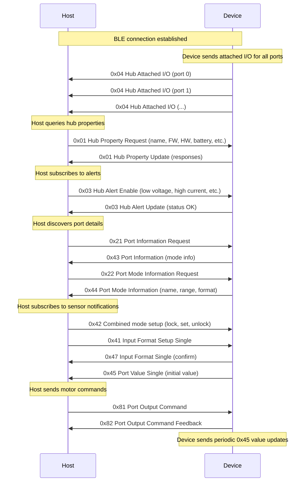
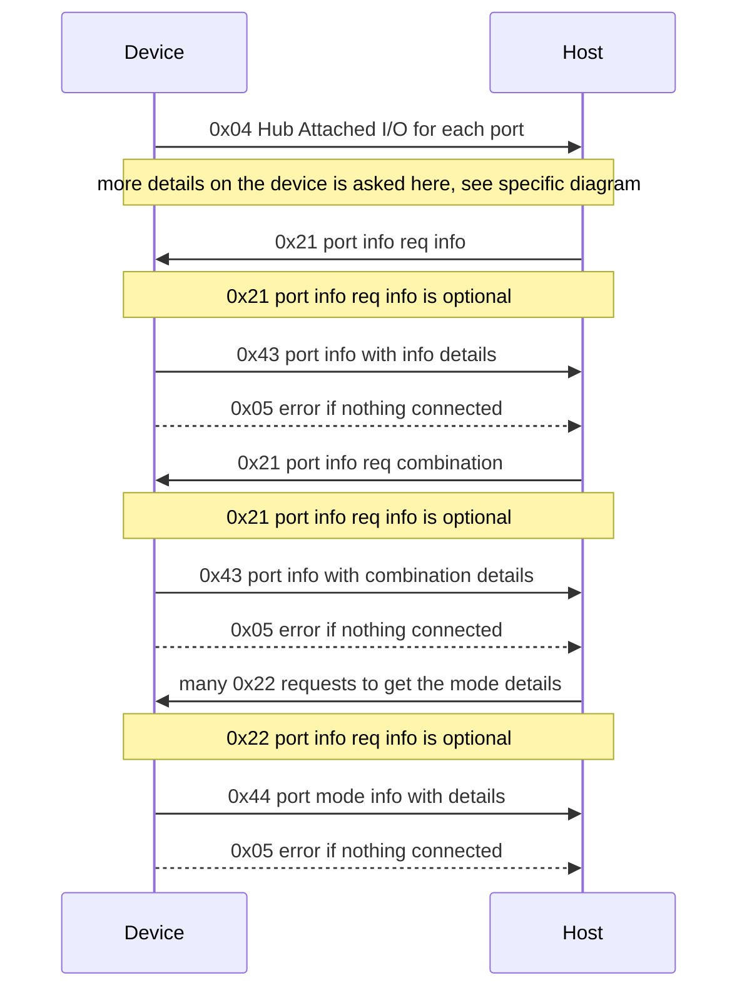

# LEGO Wireless Bluetooth Protocol 3.0.00 documentation

The main official documentation can be [found here on the official LEGO github](https://lego.github.io/lego-ble-wireless-protocol-docs/index.html). This documentation is an unofficial one containing missing elements and examples that helped creating the full project. It is also based on the [amazing work from sharpbrick](https://github.com/sharpbrick/docs) and findings from the [sharpbrick/powered-up SDK](https://github.com/sharpbrick/powered-up).

This document focuses on the communication flow, covering the full lifecycle from BLE advertising and connection through device discovery, sensor subscriptions, motor commands, and the critical feedback mechanism. It captures findings and undocumented behaviors discovered during the implementation of a working LEGO hub emulator.

In this document, we will use `->` for the communication coming from the hub/device and `<-` from the host. So depending if you are a host or a device, you will have to react in a different way.

## Table of contents

- [BLE advertising and connection](#ble-advertising-and-connection)
- [Full connection flow](#full-connection-flow)
- [Port flow](#port-flow)
  - [Advertisement of connected elements](#advertisement-of-connected-elements)
  - [Advertisement for disconnection of element](#advertisement-for-disconnection-of-element)
  - [Port information request and answer](#port-information-request-and-answer)
  - [Port mode information request and answer](#port-mode-information-request-and-answer)
- [Hub properties](#hub-properties)
- [Hub alerts](#hub-alerts)
- [Hub actions](#hub-actions)
- [Sensor subscriptions and notifications](#sensor-subscriptions-and-notifications)
  - [Subscribing to a single mode (0x41)](#subscribing-to-a-single-mode-0x41)
  - [Combined mode subscriptions (0x42)](#combined-mode-subscriptions-0x42)
  - [Periodic value notifications (0x45)](#periodic-value-notifications-0x45)
- [Motor commands and feedback](#motor-commands-and-feedback)
  - [Port output commands (0x81)](#port-output-commands-0x81)
  - [Port output command feedback (0x82) — critical finding](#port-output-command-feedback-0x82--critical-finding)
  - [WriteDirect and WriteDirectModeData](#writedirect-and-writedirectmodedata)
- [Virtual ports](#virtual-ports)
- [Known hub types and their port maps](#known-hub-types-and-their-port-maps)
  - [Move Hub (88006)](#move-hub-88006)
  - [Two Port Hub / City Hub (88009)](#two-port-hub--city-hub-88009)
  - [Technic Medium Hub (88012)](#technic-medium-hub-88012)
  - [Duplo Train Base (10874)](#duplo-train-base-10874)
  - [Mario Hub (71360)](#mario-hub-71360)
- [Emulator implementation findings](#emulator-implementation-findings)
  - [Memory management on constrained devices](#memory-management-on-constrained-devices)
  - [Motor simulation with speed ramping](#motor-simulation-with-speed-ramping)
- [Communication log analysis](#communication-log-analysis)
  - [Successful connection with alerts](#successful-connection-with-alerts)
  - [Detailed phone communication](#detailed-phone-communication)
  - [Failed connection](#failed-connection)

## BLE advertising and connection

LEGO hubs advertise over BLE using a specific service and characteristic:

| Element | UUID |
|---|---|
| Hub Service | `00001623-1212-EFDE-1623-785FEABCD123` |
| Hub Characteristic | `00001624-1212-EFDE-1623-785FEABCD123` |

The manufacturer ID in the advertising data is `0x0397` (LEGO System A/S). The advertising payload contains:

| Field | Size | Description |
|---|---|---|
| Button State | 1 byte | Whether the hub button is pressed (0x00/0x01) |
| System Type + Device Number | 1 byte | Encoded system type and device number (see table below) |
| Device Capabilities | 1 byte | Flags: supports LPF2 devices, peripheral role, central role |
| Last Network ID | 1 byte | Last HW network ID (0x00 = disable) |
| Status | 1 byte | Connection status flags |
| Option | 1 byte | Additional options |

The System Type + Device Number byte encodes both the system type (upper nibble) and the device type (lower nibble):

| Hub | System Type | Device Type | Encoded Byte |
|---|---|---|---|
| Move Hub | LegoSystem1 (0x01) | BoostHub | 0x40 |
| Two Port Hub | LegoSystem1 (0x01) | TwoPortHub | 0x41 |
| Technic Medium Hub | LegoTechnic (0x02) | TechnicMediumHub | 0x80 |
| Duplo Train Base | LegoDuplo (0x03) | DuploTrain | 0xC0 |
| Mario Hub | LegoSystem1 (0x01) | MarioHub | 0x43 |

Once a host connects to the hub via BLE and subscribes to the Hub Characteristic, the hub immediately starts sending Hub Attached I/O (0x04) messages for all its ports. No request from the host is needed to trigger this.

## Full connection flow

The complete connection sequence from captured communications follows this pattern:



## Port flow

Here is the current flow and explanation following:



### Advertisement of connected elements

Once connected to the device, without sending any message, the device sends the specification of what is connected to it with a [Hub Attached I/O message (0x04)](https://lego.github.io/lego-ble-wireless-protocol-docs/index.html#hub-attached-i-o). As an example for a MoveHub with an additional RGB sensor connected and an additional motor:

```text
-> 0F-00-04-00-01-27-00-00-00-00-10-00-00-00-10
-> 0F-00-04-01-01-27-00-00-00-00-10-00-00-00-10
-> 0F-00-04-02-01-25-00-00-00-00-10-00-00-00-10
-> 0F-00-04-03-01-26-00-00-00-00-10-00-00-00-10
-> 09-00-04-10-02-27-00-00-01
-> 0F-00-04-32-01-17-00-00-00-00-01-06-00-00-20
-> 0F-00-04-3A-01-28-00-00-00-00-10-00-00-01-02
-> 0F-00-04-3B-01-15-00-02-00-00-00-00-00-01-00
-> 0F-00-04-3C-01-14-00-02-00-00-00-00-00-01-00
-> 0F-00-04-46-01-42-00-01-00-00-00-00-00-00-10
```

By default, when nothing is connected, there are still sensors like voltage, internal motors, etc. The default list for each known hub can be found on the [sharpbrick documentation](https://github.com/sharpbrick/docs/tree/master/hubs).

This will translate into the following:

| Port ID | Port Name | Device Type | IOTypeID |
|---|---|---|---|
| 0 (0x00) | A | Internal Motor with Tacho | 0x27 |
| 1 (0x01) | B | Internal Motor with Tacho | 0x27 |
| 2 (0x02) | C | Vision Sensor (connected) | 0x25 |
| 3 (0x03) | D | External Motor with Tacho (connected) | 0x26 |
| 16 (0x10) | — | Virtual Internal Motor (A+B) | 0x27 |
| 50 (0x32) | — | RGB Light | 0x17 |
| 58 (0x3A) | — | Internal Tilt Sensor | 0x28 |
| 59 (0x3B) | — | Current Sensor | 0x15 |
| 60 (0x3C) | — | Voltage Sensor | 0x14 |
| 70 (0x46) | — | Unknown (0x42) | 0x42 |

The only difference with the default version is that there is on this version a vision sensor and an external motor connected. For the rest, this will always be advertised with the adjusted parameters.

The 0x04 message format for attached I/O is:
```
length-hubID-0x04-portID-event-IOTypeID(16bit)-HWVersion(32bit)-SWVersion(32bit)
```

For virtual ports (event=0x02), the format is shorter:
```
length-hubID-0x04-portID-0x02-IOTypeID(16bit)-portIDA-portIDB
```

This message is only coming from the device and never sent by the host.

### Advertisement for disconnection of element

Once an element is disconnected, a message is sent from the device with a [Hub Attached I/O message (0x04)](https://lego.github.io/lego-ble-wireless-protocol-docs/index.html#hub-attached-i-o). As an example:

```text
-> 05-00-04-03-00
```

The format is: `length-hubID-0x04-portID-0x00` where 0x00 is the DetachedIO event. Those notifications are sent right away.

### Port information request and answer

For each of the previously announced ports, you get more detail by sending a [Port Information Request (0x21)](https://lego.github.io/lego-ble-wireless-protocol-docs/index.html#port-information-request) by specifying the port ID and the flag asking for the port information (0x01 for mode info, 0x02 for possible mode combinations).

```text
<- 05-00-21-00-01
-> 0B-00-43-00-01-0F-03-06-00-07-00
```

The device will answer with a [0x43 message Port Information](https://lego.github.io/lego-ble-wireless-protocol-docs/index.html#port-information). There are 2 information types: mode information (0x01) and possible mode combinations (0x02).

In the previous example, for the internal motor on port 0:

```
PortID: 0, InformationType: ModeInfo, Capabilities: Output|Input|LogicalCombinable|LogicalSynchronizable,
TotalModeCount: 3, InputModes: 0b0110, OutputModes: 0b0111
```

The input and output modes are bitmasks. `InputModes=0b0110` means modes 1 and 2 are input-capable. `OutputModes=0b0111` means modes 0, 1, and 2 are output-capable. So mode 0 (POWER) is output-only, while modes 1 (SPEED) and 2 (POS) are both input and output.

The Capabilities byte is a bitmask:

| Bit | Flag | Meaning |
|---|---|---|
| 0 | Output | Port supports output (motor commands) |
| 1 | Input | Port supports input (sensor readings) |
| 2 | LogicalCombinable | Modes can be combined |
| 3 | LogicalSynchronizable | Port can be synchronized with another |

In order to populate properly from scratch all the elements, you'll have to ask for each of the advertised ports those elements. In our case:

```text
<- 05-00-21-00-01
<- 05-00-21-01-01
<- 05-00-21-02-01
<- 05-00-21-03-01
<- 05-00-21-10-01
<- 05-00-21-32-01
<- 05-00-21-3A-01
<- 05-00-21-3B-01
<- 05-00-21-3C-01
<- 05-00-21-46-01
```

The answer looks like this:

```text
-> 0B-00-43-00-01-0F-03-06-00-07-00
-> 0B-00-43-01-01-0F-03-06-00-07-00
-> 05-00-05-21-06
-> 05-00-05-21-06
-> 0B-00-43-10-01-07-03-06-00-07-00
-> 0B-00-43-32-01-01-02-00-00-03-00
-> 0B-00-43-3A-01-06-08-FF-00-00-00
-> 0B-00-43-3B-01-02-02-03-00-00-00
-> 0B-00-43-3C-01-02-02-03-00-00-00
-> 0B-00-43-46-01-04-03-00-00-00-00
```

Some of the messages are 0x05 (error), meaning generic errors. The reason is because no device is actually connected to the port (ports 2 and 3 in this case), so there is nothing to report. The error code 0x06 is `CommandNotRecognized`.

You can also request the possible combinations (information type 0x02). And you'll get something like this:

```text
-> 07-00-43-00-02-06-00
-> 07-00-43-01-02-06-00
-> 05-00-05-21-06
-> 05-00-05-21-06
-> 07-00-43-10-02-06-00
-> 05-00-43-32-02
-> 07-00-43-3A-02-1F-00
-> 05-00-43-3B-02
-> 05-00-43-3C-02
-> 07-00-43-46-02-07-00
```

For port 0 (internal motor), the combination value is `06` = `0b_0000_0110`, which means Mode 1 + Mode 2 can be combined (SPEED + POS). Note that a combination value of 0 marks the end of the combination list, and no combination data means no combinations are possible.

### Port mode information request and answer

Each port has possibly multiple modes as seen in the previous section. Like for the port configuration it is possible to ask for more details using the [0x22 Port Mode Information Request](https://lego.github.io/lego-ble-wireless-protocol-docs/index.html#port-mode-information-request) message.

The request format is: `06-00-22-portID-modeID-informationType`

The information types are:

| Value | Type | Description |
|---|---|---|
| 0x00 | NAME | Mode name (up to 11 chars, null-padded) |
| 0x01 | RAW | Raw value range (min/max as two float32) |
| 0x02 | PCT | Percentage range (min/max as two float32) |
| 0x03 | SI | SI value range (min/max as two float32) |
| 0x04 | SYMBOL | Unit symbol (up to 4 chars) |
| 0x05 | MAPPING | Input/output mapping flags |
| 0x80 | VALUE_FORMAT | Data format (datasets, type, figures, decimals) |

As per the documentation, each element has a lot of details. For example to request all the details for port 0, mode 0 (POWER) of the internal motor on the Move Hub:

```text
<- 06-00-22-00-00-00
```

A complete exchange requesting all information for all 3 modes of port 0:

```text
-> 0B-00-43-00-01-0F-03-06-00-07-00    (Port info: 3 modes)
-> 07-00-43-00-02-06-00                  (Combinations: mode 1+2)
-> 11-00-44-00-00-00-50-4F-57-45-52-00-00-00-00-00-00  (Mode 0: NAME = "POWER")
-> 0E-00-44-00-00-01-00-00-C8-C2-00-00-C8-42  (Mode 0: RAW = -100.0 to 100.0)
-> 0E-00-44-00-00-02-00-00-C8-C2-00-00-C8-42  (Mode 0: PCT = -100.0 to 100.0)
-> 0E-00-44-00-00-03-00-00-C8-C2-00-00-C8-42  (Mode 0: SI = -100.0 to 100.0)
-> 0A-00-44-00-00-04-50-43-54-00              (Mode 0: SYMBOL = "PCT")
-> 08-00-44-00-00-05-00-10                    (Mode 0: MAPPING = 0x00, 0x10)
-> 0A-00-44-00-00-80-01-00-01-00              (Mode 0: FORMAT = 1 dataset, Byte, 1 fig, 0 dec)
-> 11-00-44-00-01-00-53-50-45-45-44-00-00-00-00-00-00  (Mode 1: NAME = "SPEED")
-> 0E-00-44-00-01-01-00-00-C8-C2-00-00-C8-42  (Mode 1: RAW = -100.0 to 100.0)
-> 0E-00-44-00-01-02-00-00-C8-C2-00-00-C8-42  (Mode 1: PCT = -100.0 to 100.0)
-> 0E-00-44-00-01-03-00-00-C8-C2-00-00-C8-42  (Mode 1: SI = -100.0 to 100.0)
-> 0A-00-44-00-01-04-50-43-54-00              (Mode 1: SYMBOL = "PCT")
-> 08-00-44-00-01-05-10-10                    (Mode 1: MAPPING = 0x10, 0x10)
-> 0A-00-44-00-01-80-01-00-04-00              (Mode 1: FORMAT = 1 dataset, UInt32, 4 fig, 0 dec)
-> 11-00-44-00-02-00-50-4F-53-00-00-00-00-00-00-00-00  (Mode 2: NAME = "POS")
-> 0E-00-44-00-02-01-00-00-B4-C3-00-00-B4-43  (Mode 2: RAW = -360.0 to 360.0)
-> 0E-00-44-00-02-02-00-00-C8-C2-00-00-C8-42  (Mode 2: PCT = -100.0 to 100.0)
-> 0E-00-44-00-02-03-00-00-B4-C3-00-00-B4-43  (Mode 2: SI = -360.0 to 360.0)
-> 0A-00-44-00-02-04-44-45-47-00              (Mode 2: SYMBOL = "DEG")
-> 08-00-44-00-02-05-08-08                    (Mode 2: MAPPING = 0x08, 0x08)
-> 0A-00-44-00-02-80-01-02-04-00              (Mode 2: FORMAT = 1 dataset, UInt32, 4 fig, 0 dec — note: actually Int32)
```

The data types in VALUE_FORMAT are:

| Value | Type | Size |
|---|---|---|
| 0x00 | Byte (Int8/UInt8) | 1 byte |
| 0x01 | Int16/UInt16 | 2 bytes |
| 0x02 | Int32/UInt32 | 4 bytes |
| 0x03 | Single (float32) | 4 bytes |

As explained in the [sharpbrick docs](https://github.com/sharpbrick/docs/tree/master), those are known values for the LEGO sensors. It is not strictly necessary to request them — they can be hardcoded and reused. It is interesting to ask for the details when it's an unknown device. The name of the device can tell quite a lot. As an example, the unknown device on port 70 is a TRIGGER for mode 0, CANVAS for mode 1 and VAR for mode 2.

## Hub properties

Hub properties are queried and set using the [Hub Property message (0x01)](https://lego.github.io/lego-ble-wireless-protocol-docs/index.html#hub-property-reference). The operations are:

| Value | Operation | Direction |
|---|---|---|
| 0x01 | Set | Host → Device |
| 0x02 | Enable Updates | Host → Device |
| 0x03 | Disable Updates | Host → Device |
| 0x04 | Reset | Host → Device |
| 0x05 | Request Update | Host → Device |
| 0x06 | Update | Device → Host |

The format is: `length-hubID-0x01-property-operation-[payload]`

The following properties are supported:

| Property | ID | Payload (Update) | Settable | Resettable |
|---|---|---|---|---|
| Advertising Name | 0x01 | UTF-8 string | Yes | Yes (restores default name) |
| Button | 0x02 | 1 byte (0x00/0x01) | No | No |
| FW Version | 0x03 | 4 bytes (encoded) | No | No |
| HW Version | 0x04 | 4 bytes (encoded) | No | No |
| RSSI | 0x05 | 1 byte (signed) | No | No |
| Battery Voltage | 0x06 | 1 byte (0-100%) | No | No |
| Battery Type | 0x07 | 1 byte (0=Normal, 1=Rechargeable) | No | No |
| Manufacturer Name | 0x08 | UTF-8 string | No | No |
| Radio Firmware Version | 0x09 | UTF-8 string | No | No |
| LEGO Wireless Protocol Version | 0x0A | 2 bytes (minor, major) | No | No |
| System Type ID | 0x0B | 1 byte | No | No |
| HW Network ID | 0x0C | 1 byte | Yes | Yes |
| Primary MAC Address | 0x0D | 6 bytes | No | No |
| Secondary MAC Address | 0x0E | 6 bytes | No | No |
| Hardware Network Family | 0x0F | 1 byte | Yes | No |

Example from captured communication — the host requests all properties:

```text
<- 05-00-01-01-05    (Request Advertising Name)
-> 0D-00-01-01-06-4D-6F-76-65-20-48-75-62    (Update: "Move Hub")

<- 05-00-01-03-05    (Request FW Version)
-> 09-00-01-03-06-17-00-00-20    (Update: 2.0.0.17)

<- 05-00-01-06-05    (Request Battery Voltage)
-> 06-00-01-06-06-64    (Update: 100%)

<- 05-00-01-08-05    (Request Manufacturer Name)
-> 14-00-01-08-06-4C-45-47-4F-20-53-79-73-74-65-6D-20-41-2F-53    (Update: "LEGO System A/S")
```

**Important finding**: The host may request the same property twice — once with `Enable Updates` (0x02) and once with `Request Update` (0x05). Both should respond with an `Update` (0x06) message. The `Enable Updates` operation additionally registers the property for ongoing change notifications (e.g., battery level decreasing over time, RSSI changes, button presses).

**Version encoding**: FW and HW versions are encoded as 4-byte integers using the `VersionNumberEncoder`. The bits encode: `Major(7):Minor(4):BugFix(4):Build(17)`. For example, FW version `2.0.0.17` encodes as `17-00-00-20` in little-endian.

**Setting the name**: The host can set the advertising name with operation 0x01:

```text
<- 12-00-01-01-01-4D-6F-76-65-20-48-75-62-20-63-6F-6F-6C    (Set name to "Move Hub cool")
```

## Hub alerts

Hub alerts are managed with the [Hub Alert message (0x03)](https://lego.github.io/lego-ble-wireless-protocol-docs/index.html#hub-alerts). The host enables alert monitoring, and the device sends updates when conditions change.

The alert types are:

| Value | Alert |
|---|---|
| 0x01 | Low Voltage |
| 0x02 | High Current |
| 0x03 | Low Signal Strength |
| 0x04 | Over Power Condition |

The operations are:

| Value | Operation |
|---|---|
| 0x01 | Enable Updates |
| 0x02 | Disable Updates |
| 0x03 | Request Updates |
| 0x04 | Update |

Example from captured communication — the host enables all alert types:

```text
<- 05-00-03-02-01    (Enable Updates: High Current)
-> 06-00-03-02-04-00  (Update: Status OK)
<- 05-00-03-02-03    (Request Updates: High Current)
-> 06-00-03-02-04-00  (Update: Status OK)
<- 05-00-03-04-01    (Enable Updates: Over Power)
-> 06-00-03-04-04-00  (Update: Status OK)
<- 05-00-03-01-01    (Enable Updates: Low Voltage)
-> 06-00-03-01-04-00  (Update: Status OK)
<- 05-00-03-03-01    (Enable Updates: Low Signal)
-> 06-00-03-03-04-00  (Update: Status OK)
```

**Finding**: The host typically enables each alert and then also requests the current status. Both operations must respond with an Update (0x04) containing the current alert payload. The payload is 0x00 for "Status OK" or non-zero for an active alert condition.

## Hub actions

Hub actions are sent using the [Hub Action message (0x02)](https://lego.github.io/lego-ble-wireless-protocol-docs/index.html#hub-actions). The host sends an action command, and the device acknowledges with a corresponding "will do" response.

| Host Action (incoming) | Device Response |
|---|---|
| SwitchOffHub (0x01) | HubWillSwitchOff (0x30) |
| Disconnect (0x02) | HubWillDisconnect (0x31) |
| ActivateBusyIndication (0x03) | (none — silently acknowledged) |
| ResetBusyIndication (0x04) | (none — silently acknowledged) |
| VCCPortControlOn (0x05) | (none — silently acknowledged) |
| VCCPortControlOff (0x06) | (none — silently acknowledged) |

## Sensor subscriptions and notifications

### Subscribing to a single mode (0x41)

The host subscribes to sensor notifications using the [Port Input Format Setup Single (0x41)](https://lego.github.io/lego-ble-wireless-protocol-docs/index.html#port-input-format-setup-single) message.

Format: `0A-00-41-portID-mode-deltaInterval(32bit)-notificationEnabled`

| Field | Size | Description |
|---|---|---|
| Port ID | 1 byte | Target port |
| Mode | 1 byte | The mode to subscribe to |
| Delta Interval | 4 bytes (LE) | Minimum change required before notification is sent |
| Notification Enabled | 1 byte | 0x00 = disable, 0x01 = enable |

The device responds with a [Port Input Format Single (0x47)](https://lego.github.io/lego-ble-wireless-protocol-docs/index.html#port-input-format-single) confirmation, echoing the subscription parameters, followed immediately by a [Port Value Single (0x45)](https://lego.github.io/lego-ble-wireless-protocol-docs/index.html#port-value-single) message containing the current value.

Example — subscribing to motor speed (mode 1) on port 0:

```text
<- 0A-00-41-00-01-01-00-00-00-01    (Subscribe: port 0, mode 1, delta=1, enabled)
-> 0A-00-47-00-01-01-00-00-00-01    (Confirm: subscription active)
-> 05-00-45-00-00                    (Current value: 0)
```

**Critical behavior**: When the host sends `0x41` to set a mode, the device must:
1. Respond with `0x47` confirming the setup.
2. Immediately send a `0x45` with the current value for that mode.
3. If notification is enabled, start sending periodic `0x45` updates.

**Disabling notifications**: Sending delta=0 with notificationEnabled=0x00 disables the subscription:

```text
<- 0A-00-41-3C-00-00-00-00-00-00    (Disable: port 0x3C voltage, delta=0, disabled)
-> 0A-00-47-3C-00-00-00-00-00-00    (Confirm: subscription disabled)
```

### Combined mode subscriptions (0x42)

For ports that support mode combinations, the host uses the [Port Input Format Setup Combined Mode (0x42)](https://lego.github.io/lego-ble-wireless-protocol-docs/index.html#port-input-format-setup-combined-mode) message to receive multiple mode values in a single notification.

The setup process has a specific sequence:

```text
<- 05-00-42-00-02    (Step 1: Lock device for setup, port 0)
-> 07-00-48-00-00-00-00    (Confirm: locked)

<- 0A-00-41-00-02-01-00-00-00-01    (Step 2: Subscribe mode 2, delta=1, enabled)
-> 0A-00-47-00-02-01-00-00-00-01    (Confirm)

<- 0A-00-41-00-01-01-00-00-00-01    (Step 3: Subscribe mode 1, delta=1, enabled)
-> 0A-00-47-00-01-01-00-00-00-01    (Confirm)

<- 08-00-42-00-01-00-20-10          (Step 4: Set combination — modes 1 and 2)

<- 05-00-42-00-03                    (Step 5: Unlock and start with multi-update enabled)
```

The sub-commands for 0x42 are:

| Value | Command | Description |
|---|---|---|
| 0x01 | Set Mode & Dataset Combinations | Define which modes/datasets to combine |
| 0x02 | Lock Device For Setup | Start configuration sequence |
| 0x03 | Unlock and Start (Multi-Update Enabled) | End configuration, start sending combined updates |
| 0x04 | Unlock and Start (Multi-Update Disabled) | End configuration, no combined updates |
| 0x05 | Reset Sensor | Reset the sensor |
| 0x06 | Not Used / Power Off | Referenced in some captures |

### Periodic value notifications (0x45)

Once subscribed, the device sends periodic [Port Value Single (0x45)](https://lego.github.io/lego-ble-wireless-protocol-docs/index.html#port-value-single) messages.

Format: `length-hubID-0x45-portID-data[...]`

The data payload size and format depend on the mode's VALUE_FORMAT (from the 0x44 mode information). For example:
- Motor Speed (Byte): `05-00-45-00-7F` (port 0, value 127)
- Voltage (UInt16): `06-00-45-3C-65-0B` (port 0x3C, value 0x0B65 = 2917)
- Motor Position (Int32): `08-00-45-00-68-01-00-00` (port 0, value 360)

**Timing**: In the emulator implementation, sensor values are sent every 500ms for most sensors, and every 2 seconds (4 ticks × 500ms) for voltage and current sensors to reduce BLE traffic.

## Motor commands and feedback

### Port output commands (0x81)

The host sends motor commands using the [Port Output Command (0x81)](https://lego.github.io/lego-ble-wireless-protocol-docs/index.html#port-output-command) message.

Format: `length-hubID-0x81-portID-startupCompletion-subCommand-[payload]`

The `startupCompletion` byte contains flags:

| Bits | Value | Flag |
|---|---|---|
| Bits 0-3 | 0x01 | Buffer if necessary (ExecuteImmediately=0, BufferIfNeeded=1) |
| Bit 4 | 0x10 | Command Feedback — **must be set for the host to receive 0x82** |

Common value: `0x11` = BufferIfNeeded + CommandFeedback.

Common sub-commands:

| SubCommand | Code | Payload | Description |
|---|---|---|---|
| WriteDirect | 0x50 | portValue(1 byte) | Write a value directly to mode 0 |
| WriteDirectModeData | 0x51 | mode(1 byte) + data | Write to a specific mode |
| StartSpeed | 0x07 | speed + maxPower + profile | Set motor speed |
| StartSpeedForDegrees | 0x0B | degrees + speed + maxPower + endState + profile | Run motor for specific degrees |
| GotoAbsolutePosition | 0x0D | position + speed + maxPower + endState + profile | Move to absolute position |

Examples from captured communication:

```text
<- 08-00-81-00-11-51-00-7F    (WriteDirectModeData: port 0, mode 0, value 0x7F=127 → full power forward)
<- 08-00-81-01-11-51-00-7F    (WriteDirectModeData: port 1, mode 0, value 0x7F=127)
<- 08-00-81-10-11-51-00-7F    (WriteDirectModeData: port 16 virtual, mode 0, value 0x7F=127)
<- 08-00-81-32-11-51-00-03    (WriteDirectModeData: port 0x32 RGB, mode 0, color index 3)
<- 08-00-81-10-11-51-00-00    (WriteDirectModeData: port 16 virtual, mode 0, value 0 → stop)
<- 09-00-81-01-11-07-28-64-03 (StartSpeed: port 1, speed=40, maxPower=100, profile=3)
<- 09-00-81-01-11-05-00-00-00 (StartPower: port 1, power1=0, power2=0 → stop)
```

### Port output command feedback (0x82) — critical finding

The [Port Output Command Feedback (0x82)](https://lego.github.io/lego-ble-wireless-protocol-docs/index.html#port-output-command-feedback) message is **essential** for the host to continue sending commands. This was a critical finding from analyzing the [sharpbrick/powered-up SDK](https://github.com/sharpbrick/powered-up).

**Key insight**: The sharpbrick SDK's `SendPortOutputCommandAsync` method **awaits** the 0x82 feedback before sending the next command. Without correct feedback, the host blocks indefinitely.

Format: `05-hubID-0x82-portID-feedback`

The feedback byte is a bitmask:

| Bit | Flag | Value | Meaning |
|---|---|---|---|
| 0 | BufferEmptyCommandInProgress | 0x01 | Command is being executed |
| 1 | BufferEmptyCommandCompleted | 0x02 | Command has completed |
| 2 | CurrentCommandDiscarded | 0x04 | Command was discarded |
| 3 | Idle | 0x08 | Port is idle |

**Correct feedback value**: For `WriteDirect` and `WriteDirectModeData` commands (which complete immediately), the feedback must be:

```
Idle | BufferEmptyCommandCompleted = 0x08 | 0x02 = 0x0A
```

Example:
```text
<- 08-00-81-00-11-51-00-7F    (Motor command: port 0, power=127)
-> 05-00-82-00-0A              (Feedback: Idle + Completed)
```

**Wrong value discovered during debugging**: Initially using `0x02` (BufferEmptyCommandCompleted without Idle) caused the LEGO app and sharpbrick SDK to block after the first command. The Idle flag (0x08) must be included to signal that the port is ready for the next command.

**When to send feedback**: Only when the `CommandFeedback` flag is set in the `startupCompletion` byte (bit 4). If the flag is not set, no feedback should be sent.

For long-running commands (timed moves, goto position), the device should first send `BufferEmptyCommandInProgress` (0x01) and then `Idle | BufferEmptyCommandCompleted` (0x0A) when done.

### WriteDirect and WriteDirectModeData

These are the most common motor commands:

**WriteDirect (0x50)**: Writes a single byte value to mode 0 of the port.
```
08-00-81-portID-11-50-value
```

**WriteDirectModeData (0x51)**: Writes data to a specific mode.
```
length-00-81-portID-11-51-mode-data[...]
```

For the RGB light:
```text
<- 08-00-81-32-11-51-00-03    (Set color index 3 on RGB light)
<- 0B-00-81-3A-11-51-03-00-00-00-00    (Write tilt sensor mode 3 with 4 zero bytes)
```

For the tilt sensor configuration:
```text
<- 09-00-81-3A-11-51-06-7C-1E    (Write tilt sensor mode 6, data: 0x7C 0x1E)
```

## Virtual ports

Virtual ports combine two physical ports into a synchronized pair. They are managed with the [Virtual Port Setup (0x61)](https://lego.github.io/lego-ble-wireless-protocol-docs/index.html#virtual-port-setup) message.

On the Move Hub, port 16 (0x10) is a pre-defined virtual port combining physical ports 0 and 1 (the two internal motors). Commands sent to port 16 drive both motors simultaneously.

The virtual port setup sub-commands are:

| SubCommand | Description |
|---|---|
| 0x00 | Disconnect virtual port |
| 0x01 | Connect two ports into a virtual port |

When connecting, if the virtual port already exists (pre-defined), the device sends a new Hub Attached I/O (0x04) message with the virtual port details. If the connection is invalid, the device responds with an error (0x05).

## Known hub types and their port maps

### Move Hub (88006)

BLE Name: "Move Hub" | System: LegoSystem1 | FW: 2.0.0.17 | HW: 0.4.0.0

| Port | ID | Device | IOTypeID | Notes |
|---|---|---|---|---|
| A | 0x00 | Internal Motor with Tacho | 0x27 | Built-in motor |
| B | 0x01 | Internal Motor with Tacho | 0x27 | Built-in motor |
| C | 0x02 | (empty) | — | External port |
| D | 0x03 | (empty) | — | External port |
| — | 0x10 | Virtual Motor (A+B) | 0x27 | Virtual, combines ports 0+1 |
| — | 0x32 | RGB Light | 0x17 | Status LED |
| — | 0x3A | Tilt Sensor | 0x28 | 8 modes (ANGLE, TILT, ORINT, IMPCT, ACCEL, etc.) |
| — | 0x3B | Current Sensor | 0x15 | 2 modes (CUR L, CUR S) |
| — | 0x3C | Voltage Sensor | 0x14 | 2 modes (VLT L, VLT S) |
| — | 0x46 | Unknown (0x42) | 0x42 | 3 modes (TRIGGER, CANVAS, VAR) |

Internal motor modes: POWER (mode 0, Byte, output), SPEED (mode 1, Byte, I/O), POS (mode 2, Int32, I/O).

### Two Port Hub / City Hub (88009)

BLE Name: "Hub" | System: LegoSystem1 | FW: 1.4.0.0 | HW: 1.0.0.0

| Port | ID | Device | IOTypeID | Notes |
|---|---|---|---|---|
| A | 0x00 | (empty) | — | External port |
| B | 0x01 | (empty) | — | External port |
| — | 0x32 | RGB Light | 0x17 | Status LED |
| — | 0x3B | Current Sensor | 0x15 | Internal |
| — | 0x3C | Voltage Sensor | 0x14 | Internal |

### Technic Medium Hub (88012)

BLE Name: "Technic Hub" | System: LegoTechnic | FW: 1.3.0.0 | HW: 1.0.0.0

| Port | ID | Device | IOTypeID | Notes |
|---|---|---|---|---|
| A | 0x00 | (empty) | — | External port |
| B | 0x01 | (empty) | — | External port |
| C | 0x02 | (empty) | — | External port |
| D | 0x03 | (empty) | — | External port |
| — | 0x32 | RGB Light | 0x17 | Status LED |
| — | 0x3B | Current Sensor | 0x15 | Internal |
| — | 0x3C | Voltage Sensor | 0x14 | Internal |
| — | 0x3D | Temperature Sensor 1 | 0x3C | Internal (TEMP mode, Int16, 0.1°C) |
| — | 0x60 | Temperature Sensor 2 | 0x3C | Internal |
| — | 0x61 | Accelerometer | 0x39 | GRV mode: XYZ in mG (3×Int16) |
| — | 0x62 | Gyro Sensor | 0x3A | ROT mode: XYZ in DPS (3×Int16) |
| — | 0x63 | Tilt Sensor | 0x3B | POS mode: XYZ in degrees (3×Int16) |
| — | 0x64 | Gesture Sensor | 0x36 | GEST mode: gesture code (Byte) |

### Duplo Train Base (10874)

BLE Name: "Train Base" | System: LegoDuplo | FW: 1.6.0.0 | HW: 1.0.0.0

| Port | ID | Device | IOTypeID | Notes |
|---|---|---|---|---|
| — | 0x00 | Motor | 0x29 | T MOT (Byte), ONSEC (UInt32) |
| — | 0x01 | Speaker | 0x2A | TONE mode |
| — | 0x11 | RGB Light | 0x17 | Status LED |
| — | 0x12 | Color Sensor | 0x2B | COLOR, C TAG, REFLT, RGB I modes |
| — | 0x13 | Speedometer | 0x2C | SPEED (Int16), COUNT (UInt32) |
| — | 0x14 | Voltage Sensor | 0x14 | Internal |

**Note**: The Duplo Train Base does not have a current sensor, only a voltage sensor.

### Mario Hub (71360)

BLE Name: "Mario" | System: LegoSystem1 | FW: 1.0.0.0 | HW: 1.0.0.0

| Port | ID | Device | IOTypeID | Notes |
|---|---|---|---|---|
| — | 0x00 | Accelerometer | 0x47 | RAW (3×Byte), GEST (2×UInt16) |
| — | 0x01 | Tag Sensor | 0x49 | TAG (2×UInt16), RGB (3×Byte) |
| — | 0x02 | Pants Sensor | 0x4A | PANT (Byte) |
| — | 0x03 | Debug Interface | 0x46 | Multiple debug modes |
| — | 0x06 | Voltage Sensor | 0x14 | Internal |

**Note**: The Mario Hub does not have a current sensor. The debug interface has multiple modes for development purposes.

## Emulator implementation findings

These are practical findings discovered while implementing a working LEGO hub emulator on nanoFramework.

### Memory management on constrained devices

Building protocol messages using object constructors and `ToByteArray()` causes excessive memory allocation on constrained devices (ESP32). Two critical optimizations:

1. **Direct byte array construction for 0x45 and 0x82 messages**: Instead of creating `PortValueSingleMessage` objects (which use `ArrayList` + `ToArray()`), build the byte array directly:

```csharp
// Direct construction avoids ArrayList allocations
byte[] msg = new byte[msgLen];
msg[0] = (byte)msgLen;
msg[1] = HubID;
msg[2] = (byte)MessageType.PortValueSingle;
msg[3] = sub.PortID;
Array.Copy(valueData, 0, msg, 4, valueSize);
```

2. **Periodic garbage collection**: Call `nanoFramework.Runtime.Native.GC.Run(true)` after each sensor timer tick to reclaim temporary allocations:

```csharp
#if NANOFRAMEWORK
    nanoFramework.Runtime.Native.GC.Run(true);
#endif
```

3. **Avoid synchronous BLE writes in callbacks**: Sending BLE notifications synchronously inside a BLE write callback caused `OutOfMemoryException`. Motor subscriptions are created without immediate sends — the timer handles delivery.

### Motor simulation with speed ramping

Real LEGO motors don't instantly reach their target speed. The emulator simulates gradual acceleration and deceleration using a `RampToward` helper:

```csharp
// Gradually moves current toward target by up to step per tick (500ms)
static int RampToward(int current, int target, int step)
{
    int diff = target - current;
    if (diff > step) return current + step;
    if (diff < -step) return current - step;
    return target;
}
```

The ramp rates per device type:
- **Duplo Train Motor**: ±10 per tick
- **Duplo Train Speedometer**: ±8 per tick (speed is ~3× motor power)
- **Internal Motor with Tacho**: ±15 per tick

When a motor command sets the power to 0, the `CurrentSpeed` gradually ramps down to 0 over several ticks, simulating momentum. When direction changes (e.g., forward to reverse), the speed crosses through 0 naturally.

## Communication log analysis

### Successful connection with alerts

From `BasicConnectionWithAlerts.txt` — shows a complete connection where the host queries all properties and enables all alerts:

1. **Host requests properties one by one** (0x01 with operation 0x05 = Request Update)
2. **Device responds with Hub Attached I/O** (0x04) for all ports interleaved with property responses
3. **Host subscribes to RSSI updates** (property 0x05 with Enable Updates 0x02)
4. **RSSI values stream** (0x05 = -80, decreasing to ~-57)
5. **Host sends combined mode setup** (0x42 port 0, subcommand 0x02 = lock)
6. **Host requests property updates** for button, RSSI, and battery

Key observation: The RSSI values change rapidly (multiple per second), which is normal BLE behavior. The host monitors signal strength to detect when the hub is moving out of range.

### Detailed phone communication

From `DetailedCommunicationWithPhone.txt` — shows the LEGO app's complete interaction pattern:

1. **Alert setup first**: The app enables all 4 alert types (High Current, Over Power, Low Voltage, Low Signal) before querying properties
2. **Property queries**: FW version, HW version, radio FW version, manufacturer name, battery type, LEGO protocol version, MAC address
3. **Enable property updates**: Button (0x02), RSSI (0x05), Battery (0x06), Name (0x01) — all with both Enable Updates and Request Update
4. **Port setup for motors**: Combined mode lock → subscribe mode 2 (POS, delta=1) → subscribe mode 1 (SPEED, delta=1) → set combination → unlock
5. **Port setup for tilt sensor**: Lock → subscribe modes 4, 3, 0, 2 → set combination → unlock
6. **Subscribe voltage/current**: delta=30 for voltage, delta=30 for current
7. **Motor commands**: WriteDirect (0x51) to various ports, interleaved with RGB light color changes

Critical sequence for motor port setup:
```text
<- 05-00-42-00-02                       (Lock port 0)
-> 07-00-48-00-00-00-00                  (Locked confirmation)
<- 0A-00-41-00-02-01-00-00-00-01        (Subscribe POS mode, delta=1)
-> 0A-00-47-00-02-01-00-00-00-01        (Confirmed)
<- 0A-00-41-00-01-01-00-00-00-01        (Subscribe SPEED mode, delta=1)
-> 0A-00-47-00-01-01-00-00-00-01        (Confirmed)
<- 08-00-42-00-01-00-20-10              (Set combination: index 0, mode 1 + mode 2)
<- 05-00-42-00-03                       (Unlock and start multi-update)
```

### Failed connection

From `FailedConnection.txt` — shows what happens with an incompatible hub:

1. Device sends Hub Attached I/O for ports, but port 0x46 reports an unknown type (0xFF-FF)
2. Host sends alert setup sequences
3. Host queries properties normally
4. **Connection ends here** — likely because the unknown device type confused the host

The key difference: `0F-00-04-46-01-FF-FF-01-00-00-00-00-00-00-10` uses IOTypeID `0xFFFF` instead of the correct `0x0042`. This shows that incorrect IOTypeID values can cause the host application to abort the connection.
